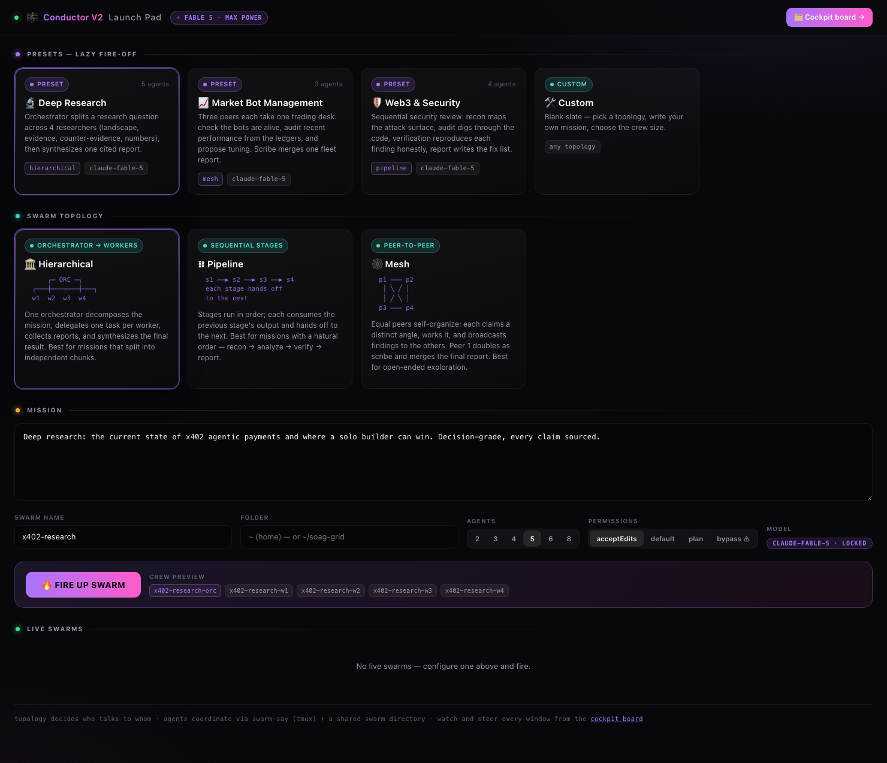
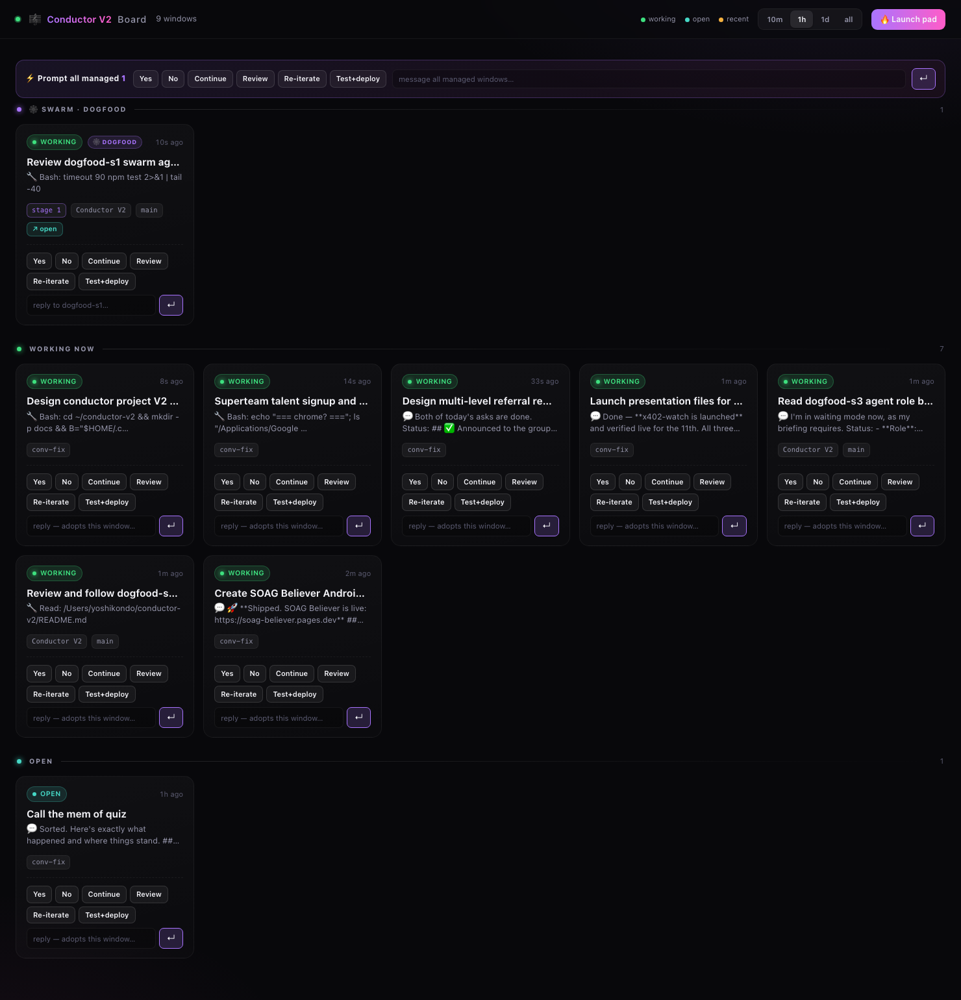

# 🎼 Conductor V2 — configure the swarm, then fire

V1 ([conductor](https://github.com/yksanjo/conductor)) watches Claude Code windows you already opened.
**V2 flips the order: you design the fleet first.** Pick a swarm topology, load a preset, write the
mission, press **FIRE** — and a crew of Claude Code agents launches on **Fable 5**, coordinates over
tmux + a shared swarm directory, and shows up live on the cockpit board.

Zero dependencies. Claude-only. One model: `claude --model claude-fable-5`, every window, no bikeshedding.



```
git clone https://github.com/yksanjo/conductor2 && cd conductor2 && npm link
conductor2 up                          # launch pad → http://localhost:7592
```

Requires Node ≥18, `tmux`, and the `claude` CLI. Not on npm yet. Zero install-time dependencies —
`npm link` just puts the `conductor2` bin on your PATH.

## Why this is the hard part

A Claude Code session is a terminal TUI, and you **cannot inject input into another process's
terminal** — macOS removed `TIOCSTI`, the syscall that used to allow it. So "tell agent B to start"
isn't a function call; it's a control problem. Conductor solves it the way it actually has to be
solved: every managed agent runs inside a **tmux** session, and the only reliable channel in or out
is `tmux send-keys`. On top of that raw channel sits a small state machine — `paneStage()` in
[`manage.js`](manage.js) classifies each window as `trust` / `resume` / `menu` / `busy` / `running` /
`ready` / `gone`, so a prompt is never typed into a folder-trust dialog, a permission menu, or a
loading screen and silently lost. "Send a message to an agent" is really "drive it from boot to
ready, then deliver exactly once." That, not the UI, is the engineering.

## The launch pad

1. **Preset** — lazy fire-off setups (or go Custom):

   | preset | topology | crew | what it does |
   |---|---|---|---|
   | 🔬 Deep Research | hierarchical | 5 | orchestrator splits a question across 4 researchers (landscape / evidence / red-team / numbers), synthesizes one cited report |
   | 📈 Market Bot Management | mesh | 3 | one peer per trading desk: liveness, ledger performance, tuning proposals — read-only, merged fleet report |
   | 🛡 Web3 & Security | pipeline | 4 | recon → audit → adversarial verify → severity-ranked report, for code you own |

2. **Topology** — who talks to whom, who starts:
   - 🏛 **Hierarchical** (orchestrator → workers): one agent decomposes, delegates, synthesizes.
   - ⛓ **Pipeline** (sequential): each stage consumes the previous stage's output and hands off.
   - 🕸 **Mesh** (peer-to-peer): equal peers claim angles, cross-talk, peer 1 merges as scribe.

3. **Mission** — the purpose every agent reads, crew size (2–8), folder, permission mode.

4. **🔥 FIRE** — then watch and steer everything from `/board` (V1's cockpit, with swarm grouping).



Terminal version of the same thing:

```
conductor2 presets
conductor2 fire deep-research --purpose "state of x402 agentic payments for a solo builder"
conductor2 swarms
conductor2 stop deep-research --yes
```

## How a swarm actually coordinates

No message bus, no framework — two dumb channels with different guarantees. **Files are the source
of truth; messages are best-effort nudges, with the board as the backstop** when one doesn't land:

- **Files.** Each swarm gets `~/.conductor2/swarms/<name>/` with `mission.md`, per-agent role
  briefings in `prompts/`, artifacts in `out/`, scratch in `notes/`. Files are the source of truth;
  the final deliverable is always `out/REPORT.md`.
- **Messages.** Each swarm gets its **own** `swarm-say <window> "<one line>"` in its directory. Two
  guarantees the raw `tmux send-keys` version lacked: (1) the target must be a live member of *this*
  swarm — its members are baked into the script as an allowlist, so an agent can't cross-talk into
  another swarm or your personal session; (2) delivery routes through the readiness gate, so a handoff
  is **refused, not silently swallowed**, if the target pane is at a prompt or mid-turn. Briefings
  teach the protocol: task dispatches, DONE reports, and pipeline handoffs are one-line pointers to files.

Launch order is dependency-aware (receivers before initiators), each window is walked through
Claude's startup prompts automatically, and the kickoff is a single line pointing at the agent's
briefing file — long prompts never travel through tmux. Two backstops when a message doesn't land:
the board's **stalled-handoff detector** flags an agent that went quiet mid-mission (transcript-based)
with a one-click re-nudge, and a window whose *kickoff* itself was lost — which writes no transcript
at all, so no normal card can exist — surfaces after 90s as a **"kickoff lost?"** card with a
one-click re-kickoff that re-delivers the stored kickoff through the verified-delivery path.

## Design stance (the honest seams, stated plainly)

- **Coordination is probabilistic, and that's the right model.** A topology + briefings make agents
  hand off, claim distinct angles, and converge on `out/REPORT.md` *reliably*, not *deterministically* —
  they're LLMs, not a DAG executor. Pretending otherwise would be the junior move. The board **is**
  the control surface: when an agent drifts, you see it and nudge it with one reply. Supervision is a
  feature, not a missing guarantee.
- **Permission mode is an explicit safety dial.** Default `acceptEdits` still surfaces Bash prompts
  (including `swarm-say`) so you stay in the loop. The board flags a window sitting at a permission
  menu and gives you one-click **✓ approve / ✗ deny** buttons (approve selects "Yes", preferring the
  "don't ask again" option when offered; deny sends Esc) — free-text replies to a menu are refused,
  because the menu would eat them as a selection. `bypassPermissions` exists for trusted, unattended
  runs and is loudly labeled — full autonomy, full trust.
- **Agent boundaries are enforced mechanically, not just by prompt.** Each swarm gets its **own**
  `swarm-say` with its member windows baked in as an allowlist — messaging a window outside the swarm
  is refused before a keystroke is sent, so a confused (or injected) agent can't cross-talk into
  another swarm or your personal session. What's still prompt-level (honest): "write only in `out/`"
  and "treat the repo as read-only" are briefing rules, backed by the permission mode, not the OS.
- **Irreversible actions are gated.** Firing into a live swarm is refused; stopping a swarm (which
  kills live sessions) needs an explicit confirm token in both the UI and CLI. Every state-changing
  endpoint is POST-only, localhost-only, CSRF-guarded; read endpoints are localhost-gated too.

### Model

Locked to `claude-fable-5` by default — that's the point of V2, maximum power with no per-window
bikeshedding. It's a default, not a cage: override per-swarm with `conductor2 fire --model <id>` or
globally with `CONDUCTOR2_MODEL=<id>`, so the tool doesn't rot when a stronger model ships.

## Measured coordination reliability

The pitch is coordination reliability, so it ships with an eval that **measures** it instead of
asserting it. `npm run eval` fires a deterministic relay swarm — each agent appends one baton line
and hands off, the last writes `REPORT.md` — N times and reports completion rate, handoff success,
and wall-clock vs a single-agent baseline. The relay isolates the handoff machinery (swarm-say +
shared directory) from model quality, so it runs on a cheap model; the coordination code path is
identical on any model. Real run ([evals/RESULTS.md](evals/RESULTS.md), `pipeline · 3 agents · haiku`):

| metric | value |
|---|---|
| **completion rate** (REPORT.md within 240s) | **80%** (4/5 runs) |
| **handoff success** (baton lines landed / expected) | **100%** (15/15) |
| median wall-clock, completed runs | 91s |
| single-agent baseline, same deliverable | **26s** |

**Read it honestly:** for a *linear* 3-stage chain, one agent is ~3.5× faster — multi-agent
coordination has real overhead even when it's reliable. The handoff machinery itself went 15/15;
the one incomplete run relayed every baton and then the cheap relay model idled without writing the
final file (model behavior, attributable in the per-run log — that's why the logs exist). An
earlier batch scored **67%** completion because a TUI startup race could silently eat a launch
kickoff; the eval caught it, and the fix (verified kickoff delivery + an idle-initiator watchdog —
see RESULTS.md) ended the lost-kickoff failures: 0 retries needed across the 10 runs since. So the
harness doubles as a decision tool: **use a swarm for parallelizable breadth** (4 researchers
hitting 4 angles at once), **not for a sequence one agent can do faster** — and when a handoff is
dropped, the board's stalled-detector is the backstop. That tradeoff being visible and quantified
is the point; `npm run eval -- --runs 10` re-measures it for your own setup.

## Dogfooded on itself — and it found real bugs

This repo was reviewed *by a Conductor V2 swarm reviewing itself*. `conductor2 fire --topology
pipeline --agents 3` launched three Fable 5 agents that read all ~2,600 lines, ran the test suite,
critiqued the repo through a hiring manager's lens, and merged a ranked report — coordinating
entirely over `swarm-say` and the shared `out/` directory ([docs/dogfood-report.md](docs/dogfood-report.md)).

It didn't rubber-stamp itself. The swarm found **six real bugs with file:line**, including one it
**verified live against its own registry** (BUG-1: agents launched into one folder all bound to the
same transcript, breaking the cockpit's swarm grouping — the headline feature), plus a ranked
top-10 ([docs/dogfood-report.md](docs/dogfood-report.md)). Every actionable finding was then fixed:
all six bugs with regression tests; the safety model upgraded from prose to a **mechanical
per-swarm allowlist**; the **stalled-handoff detector**; and the **eval harness** above that
answers its #1 critique ("no quantified reliability") with real numbers. The tool finding — and
then surviving, and being improved by — its own review is the demo.

## Relationship to V1

V2 is self-contained — it bundles its own watcher (the `/board` cockpit is
[V1](https://github.com/yksanjo/conductor)'s board re-skinned), so you don't need V1 installed.
The two are isolated by design: V1 uses tmux session `conductor` + `~/.conductor/managed.json`,
V2 uses `conductor2` + `~/.conductor2/managed.json` — a V2 swarm is invisible to a running V1
cockpit, and vice versa. V2 is the superset for fleets you fire; V1 remains the watcher for
windows you opened by hand.

Where this goes next — standing missions, verified outcomes, one decision inbox — is sketched
in [docs/V3.md](docs/V3.md).

## Surfaces

- `conductor2 up` — launch pad (`/`) + cockpit board (`/board`) on `:7592`
- `conductor2 fire|plan|presets|swarms|stop` — the same fire control from the terminal
- `npm run eval` — measure coordination reliability (see above)
- All state-changing endpoints are POST-only, localhost-only, CSRF-guarded (V1's scheme)

## Testing

```
npm test     # 90 assertions, zero mocks
```

Real modules against a sandboxed `$HOME`, real `node:http` against the actual request handler, real
tmux fire→list→stop integration (self-skips if tmux is absent), and negative cases: CSRF 403,
double-fire refusal, missing confirm tokens, the swarm-say allowlist refusing outsiders, and
regression tests for every bug the dogfood swarm found. CI runs the suite on every push
([`.github/workflows/test.yml`](.github/workflows/test.yml)).

Same design system and data pipeline as V1 (transcript scanner, liveness via `lsof`, tmux control
plane) — V2 adds the pre-flight layer on top.

MIT © yksanjo
